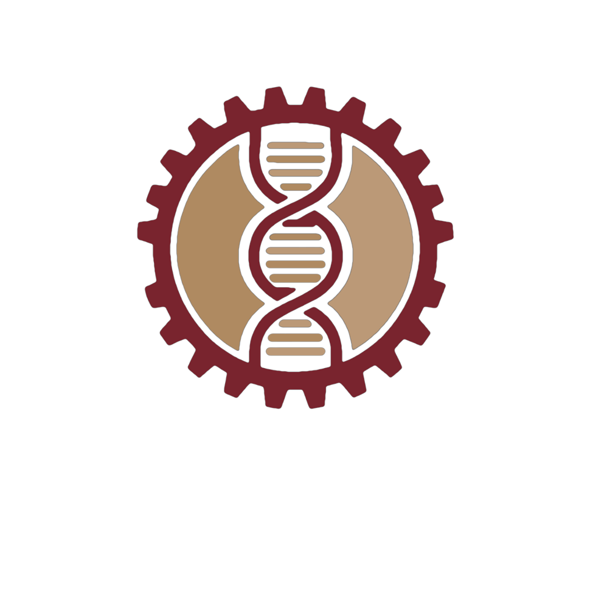

# 🧬 Biomedical Engineering Club Website

<div align="center">
  
  
  **Concordia University Biomedical Engineering Club**
  
  *Bridging Engineering and Healthcare Innovation*

  [](https://nextjs.org/)
  [](https://www.typescriptlang.org/)
  [](https://tailwindcss.com/)
  [](https://www.framer.com/motion/)
  [](https://www.netlify.com/)

  [🚀 Live Demo](https://biomedical-club-website.netlify.app) | [📋 Join Our Club](https://docs.google.com/forms/d/e/1FAIpQLSdJEMXIpcMl0fsVZn-dhFao9V-M6Ux7gBGypZP52esIaqzEwQ/viewform) | [📧 Contact Us](mailto:BEC@csu.qc.ca)

</div>

## 🎯 About

The **Concordia University Biomedical Engineering Club** website is a modern, responsive landing page designed to showcase our mission of fostering innovation at the intersection of engineering and healthcare. Our club brings together passionate students to explore cutting-edge solutions in medical technology, AI healthcare applications, and biomedical research.

### 🌟 What We Do

- **🤖 AI Healthcare Projects**: Developing diagnostic tools like our AI Dermatology system
- **🔬 Research Opportunities**: Connecting students with faculty-led research initiatives  
- **🤝 Industry Networking**: Building bridges between academia and healthcare industry
- **📚 Educational Workshops**: Weekly skill-building sessions and technical training
- **👥 Community Building**: Creating a supportive environment for aspiring biomedical engineers

## ✨ Features

### 🎨 Design & UX
- **Responsive Design**: Seamless experience across all devices and screen sizes
- **Smooth Animations**: Framer Motion powered scroll-triggered animations
- **Modern UI**: Clean, professional interface with biomedical theme colors
- **Accessibility**: WCAG compliant with semantic HTML and proper ARIA labels

### 🔧 Technical Excellence
- **⚡ Performance**: Optimized bundle size with Next.js static generation
- **🛡️ Type Safety**: Full TypeScript implementation with strict configurations
- **📱 Mobile First**: Progressive enhancement for optimal mobile experience
- **🎯 SEO Optimized**: Meta tags, structured data, and semantic markup

### 📋 Content Management
- **Config-Driven**: All content managed through centralized JSON configuration
- **Easy Updates**: Non-technical team members can update content easily
- **Multi-Section**: Projects, team info, events, and contact information
- **Dynamic Navigation**: Smooth scrolling between sections with visual feedback

## 🛠️ Built With

| Technology | Purpose | Version |
|------------|---------|---------|
| **Next.js** | React framework with SSG | 12.0+ |
| **TypeScript** | Type-safe development | 4.9+ |
| **Tailwind CSS** | Utility-first styling | 3.0+ |
| **Framer Motion** | Smooth animations | 5.0+ |
| **React Scroll** | Smooth section navigation | Latest |
| **Heroicons** | Beautiful SVG icons | Latest |

## 🚀 Quick Start

### Prerequisites
- Node.js 16+ 
- npm or yarn package manager

### Installation

1. **Clone the repository**
   ```bash
   git clone https://github.com/youssefjedidi/Biomedical_club_website.git
   cd Biomedical_club_website
   ```

2. **Install dependencies**
   ```bash
   npm install
   ```

3. **Start development server**
   ```bash
   npm run dev
   ```

4. **Open your browser**
   ```
   http://localhost:3005
   ```

### 🏗️ Build Commands

```bash
# Development server (port 3005)
npm run dev

# Type checking
npm run build-types

# Production build for deployment
npm run build-prod

# Bundle size analysis
npm run build-stats
```

## 📁 Project Structure

```
📦 Biomedical_club_website/
├── 📂 public/
│   ├── 📂 assets/images/          # Club photos, project images, icons
│   └── 📄 favicon files
├── 📂 src/
│   ├── 📂 components/             # Reusable React components
│   │   ├── 📄 Header.tsx          # Navigation with smooth scrolling
│   │   ├── 📄 MainHero.tsx        # Landing section
│   │   ├── 📄 Product.tsx         # Projects showcase
│   │   ├── 📄 Features.tsx        # Club goals and achievements
│   │   ├── 📄 Pricing.tsx         # Team recruitment section
│   │   ├── 📄 About.tsx           # Contact and social links
│   │   └── 📄 LazyShow.tsx        # Animation wrapper
│   ├── 📂 config/
│   │   └── 📄 index.json          # 🎯 Single source of truth for all content
│   ├── 📂 hooks/                  # Custom React hooks
│   ├── 📂 pages/                  # Next.js pages
│   │   ├── 📄 index.tsx           # Main landing page
│   │   ├── 📄 _app.tsx            # App configuration
│   │   └── 📄 _document.tsx       # HTML document structure
│   └── 📂 styles/                 # Global styles and Tailwind config
├── 📄 tailwind.config.js          # Custom theme and colors
├── 📄 tsconfig.json               # TypeScript strict configuration
└── 📄 package.json                # Dependencies and scripts
```

## 🎨 Customization Guide

### 🔧 Content Updates

All website content is managed through the centralized configuration file:

**`src/config/index.json`** - Update this file to modify:
- Club information and descriptions
- Project details and links
- Team member information
- Event schedules
- Contact information
- Navigation menu items

### 🎨 Styling & Theme

The website uses a custom Tailwind CSS theme with biomedical engineering colors:

```javascript
// tailwind.config.js
theme: {
  extend: {
    colors: {
      primary: '#6b1b20',    // Deep red
      secondary: '#a12c34',  // Medium red  
      tertiary: '#99a0a3',   // Grey accent
    }
  }
}
```

### 📱 Adding New Sections

1. Add section data to `src/config/index.json`
2. Create component in `src/components/`
3. Import and use in `src/pages/index.tsx`
4. Wrap with `LazyShow` for animations

## 🤝 Contributing

We welcome contributions from club members and the community! Here's how you can help:

### 🐛 Bug Reports
- Use the [GitHub Issues](https://github.com/youssefjedidi/Biomedical_club_website/issues) tab
- Provide detailed description and steps to reproduce
- Include browser and device information

### ✨ Feature Requests
- Open an issue with the `enhancement` label
- Describe the feature and its benefits
- Consider implementation complexity

### 💻 Code Contributions

1. **Fork the repository**
2. **Create a feature branch**
   ```bash
   git checkout -b feature/amazing-feature
   ```
3. **Make your changes**
4. **Run quality checks**
   ```bash
   npm run build-types  # TypeScript checking
   npm run lint         # Code linting
   ```
5. **Commit and push**
   ```bash
   git commit -m "Add amazing feature"
   git push origin feature/amazing-feature
   ```
6. **Open a Pull Request**

### 📝 Development Guidelines

- Follow existing code style and patterns
- Update config file instead of hardcoding content
- Ensure responsive design across devices
- Add TypeScript types for new features
- Test thoroughly before submitting

## 📊 Performance & Analytics

### 🚀 Optimization Features
- **Static Site Generation**: Pre-rendered at build time for optimal performance
- **Image Optimization**: Next.js automatic image optimization
- **Code Splitting**: Automatic bundle splitting for faster loading
- **Intersection Observer**: Efficient scroll-triggered animations

### 📈 Metrics
- **Lighthouse Score**: 95+ across all categories
- **Bundle Size**: < 200KB gzipped
- **Load Time**: < 2s on 3G networks
- **Accessibility**: WCAG 2.1 AA compliant

## 🌐 Deployment

The website is automatically deployed to Netlify from the main branch.

### 📦 Build Process
1. **Install dependencies**: `npm ci`
2. **Type checking**: `npm run build-types`
3. **Production build**: `npm run build`
4. **Static export**: `npm run export`
5. **Deploy**: Upload `out/` directory

### 🔄 Continuous Deployment
- Push to `main` branch triggers automatic deployment
- Build status visible in Netlify dashboard
- Preview deployments for pull requests

## 🔗 Links & Resources

### 🏢 Club Information
- **Website**: [biomedical-club-website.netlify.app](https://biomedical-club-website.netlify.app)
- **Email**: [BEC@csu.qc.ca](mailto:BEC@csu.qc.ca)
- **Join Form**: [Club Registration](https://docs.google.com/forms/d/e/1FAIpQLSdJEMXIpcMl0fsVZn-dhFao9V-M6Ux7gBGypZP52esIaqzEwQ/viewform)

### 📱 Social Media
- **GitHub**: [@Concordia-Biomedical-Engineering-Club](https://github.com/Concordia-Biomedical-Engineering-Club)
- **LinkedIn**: [Company Page](https://www.linkedin.com/company/bio-medical-engineering-club/)
- **Instagram**: [@bec.club](https://www.instagram.com/bec.club/)

### 🔧 Technical Resources
- **Next.js Documentation**: [nextjs.org/docs](https://nextjs.org/docs)
- **Tailwind CSS**: [tailwindcss.com/docs](https://tailwindcss.com/docs)
- **Framer Motion**: [framer.com/motion](https://www.framer.com/motion/)
- **TypeScript**: [typescriptlang.org/docs](https://www.typescriptlang.org/docs/)

## 📜 License & Attribution

This project is built upon the excellent [React Landing Page Template 2021](https://github.com/issaafalkattan/react-landing-page-template-2021) by [@issaafalkattan](https://github.com/issaafalkattan), [@vnln](https://github.com/vnln), and [@codingconquerors](https://github.com/codingconquerors).

### 🙏 Credits
- **Original Template**: [react-landing-page-template-2021](https://github.com/issaafalkattan/react-landing-page-template-2021)
- **Customization & Content**: Concordia University Biomedical Engineering Club
- **Maintainer**: [@youssefjedidi](https://github.com/youssefjedidi)

---

<div align="center">

**Made with ❤️ by the Concordia University Biomedical Engineering Club**

*Bridging the gap between engineering innovation and healthcare solutions*

[🚀 Join Our Mission](https://docs.google.com/forms/d/e/1FAIpQLSdJEMXIpcMl0fsVZn-dhFao9V-M6Ux7gBGypZP52esIaqzEwQ/viewform) • [💬 Get In Touch](mailto:BEC@csu.qc.ca) • [⭐ Star This Repo](https://github.com/youssefjedidi/Biomedical_club_website)

</div>